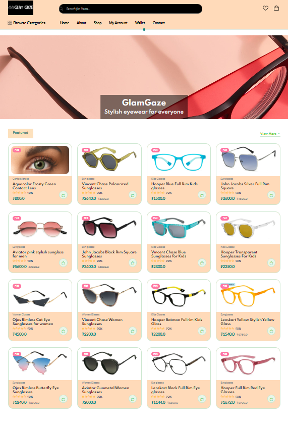

<div align="center">

# 🕶️ GLAMGAZE 
### *Premium Eyewear E-Commerce Solution*

[](https://www.oracle.com/java/)
[](https://spring.io/projects/spring-boot)
[](https://www.postgresql.org/)
[](https://aws.amazon.com/)

**A Robust, Multi-Module Java Full-Stack Application**
</div>

---

## 📖 Project Overview
**GLAMGAZE** is a professional-grade e-commerce platform dedicated to eyewear. Built using the **Spring Boot** ecosystem, this project demonstrates a highly scalable **Multi-Module Maven Architecture**. It separates core business logic from the user-facing storefront and administrative dashboard, ensuring clean code and modularity.

---

## 📸 App Preview



## 🏗️ Architecture Design
The project is structured into three primary modules to maintain a clean **Separation of Concerns**:

* **📂 Library:** The heart of the application. Contains shared `Entities`, `Repositories`, and `DTOs`. This module is a dependency for both Admin and Customer modules.
* **📂 Admin:** A secure management portal. Features include inventory control, category management, and order tracking.
* **📂 Customer:** The premium storefront. Includes product discovery, cart management, and a secure checkout process.

---

## ✨ Key Features

### 👨‍💼 Admin Dashboard
* **Inventory Management:** Full CRUD operations for glasses and frames.
* **Category Logic:** Organize products by brand, style, or price point.
* **Security:** Role-based access control (RBAC) via **Spring Security**.

### 🛒 Customer Storefront
* **Dynamic Catalog:** Responsive product grid with real-time availability.
* **Shopping Cart:** Persistent cart management.
* **User Profiles:** Secure registration and order history tracking.

---

## 💻 Tech Stack

| Layer | Technology |
| :--- | :--- |
| **Backend** | Java 17, Spring Boot, Spring Data JPA, Spring Security |
| **Frontend** | Thymeleaf, SCSS, JavaScript, HTML5 |
| **Database** | PostgreSQL |
| **Build Tool** | Maven (Multi-module) |
| **DevOps** | Nginx, AWS EC2, Git |

---

## 🚦 Getting Started

### Prerequisites
* **JDK 17**
* **Maven 3.x**
* **PostgreSQL**


## Installation

To set up GLAMGAZE locally, follow these steps:

1. Clone the repository:
```bash
   git clone https://github.com/yourusername/GLAMGAZE.git
  
```

2. Navigate to the project directory:
```bash
cd GLAMGAZE

````
3. Install the required dependencies:
 ```bash
 ./mvnw install

```
4. Configure your application.properties file with your database credentials:
```bash

spring.datasource.url=jdbc:postgresql://localhost:5432/glamgazedb2
spring.datasource.username=your_username
spring.datasource.password=your_password
```
5. Run the application:
```bash
./mvnw spring-boot:run
```

## Usage

1. Open your web browser and navigate to [http://localhost:8021/glamgaze](http://localhost:8021/glamgaze) for customer side
2. navigate to [http://localhost:8020/admin](http://localhost:8020/admin) for admin side
2. Create an account or log in to access the store.
3. Browse products, add items to your cart or wishlist, and proceed to checkout.

## Contact

For any inquiries or feedback, feel free to reach out:

- **Email:** [reachfaizal08@gmail.com](reachfaizal08@gmail.com)
- **GitHub:** [faizal08](https://github.com/ivinmanuel)


